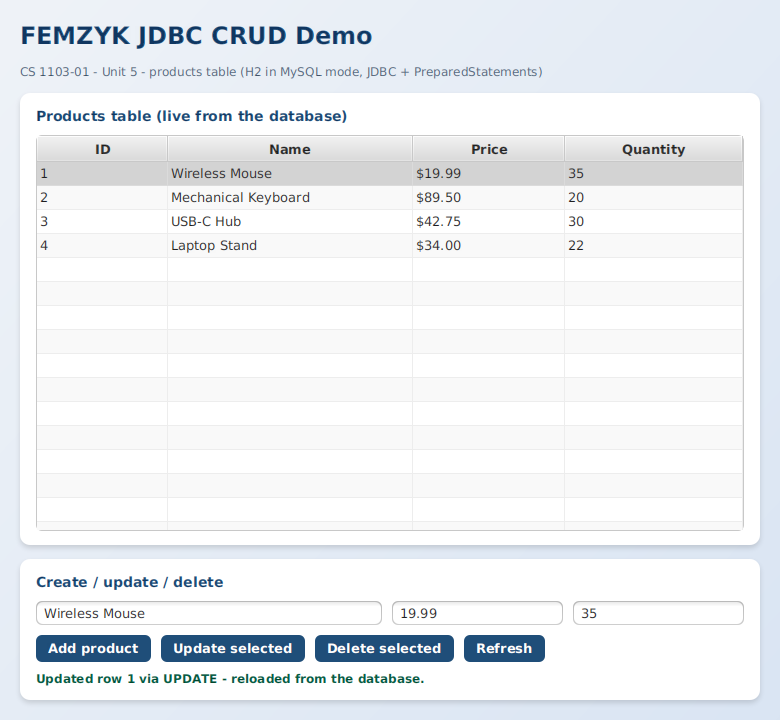

# FEMZYK JDBC CRUD Demo

A companion demo for *CS 1103-01 – Unit 5 (JDBC and CRUD operations)*, built to the same
standard as the other FEMZYK projects: a layered **core data layer**, a styled **JavaFX
admin panel**, and a **console demonstration** — real SQL CRUD against an embedded SQL
database, with transactions and injection-safe queries.

🔗 **Repository:** https://github.com/FEMZYKENTLTD/FEMZYK-JdbcCrudDemo



## 🗄 What it demonstrates

| Concept | Where | How |
|---------|-------|-----|
| **JDBC connectivity** | `ProductRepository.getConnection()` | `DriverManager.getConnection()` with a JDBC URL (H2 embedded in **MySQL compatibility mode**, so the identical SQL runs against a real MySQL server — only the URL and driver would change) |
| **CREATE** | `create()` | Parameterized `INSERT` returning database-generated keys |
| **READ** | `findAll()`, `findById()`, `findByNameContaining()` | `SELECT` with `ResultSet` mapping and a `LIKE` search |
| **UPDATE** | `update()` | Parameterized `UPDATE` returning the affected-row count |
| **DELETE** | `delete()` | Parameterized `DELETE` returning the affected-row count |
| **Transactions** | `transferStock()` | `setAutoCommit(false)` → row locking → debit + credit → `commit()`; any failure triggers `rollback()` — proven by conserving total stock |
| **SQL injection safety** | everywhere | Every query is a `PreparedStatement`; a literal `"' OR '1'='1"` payload returns 0 rows instead of dumping the table |
| **Resource management** | everywhere | Connections, statements and result sets opened in try-with-resources and closed automatically |

## 🧱 Project layout

```
FEMZYK-JdbcCrudDemo/
├── pom.xml                                            Maven build file (H2 + JavaFX + plugins)
├── docs/                                              Screenshots used by this README
└── src
    ├── main/java/com/femzyk/jdbccrud
    │   ├── core/Product.java                          Value record for one table row
    │   ├── core/ProductRepository.java                JDBC data layer: all CRUD + transactions
    │   ├── console/ConsoleApp.java                    Full CRUD walkthrough + integrity proof
    │   └── gui
    │       ├── Launcher.java                          Entry point of the JavaFX front end
    │       └── CrudFxApp.java                         Admin panel over the products table
    ├── main/resources/com/femzyk/jdbccrud/gui
    │   └── styles.css                                 JavaFX stylesheet
    └── test/java/com/femzyk/jdbccrud/gui
        └── SnapshotRunner.java                        Dev utility that captures the GUI screenshot
```

## ✅ Requirements

- **JDK 17 or newer** (built and tested on JDK 25 with JavaFX 26)
- **Maven 3.8+**
- No database server needed — H2 runs embedded in MySQL compatibility mode
- VS Code users: the **Extension Pack for Java** extension

## 🚀 Build and run

```bash
# 1. compile and package (clean build: no errors, no warnings)
mvn clean package

# 2. run the console CRUD walkthrough
mvn compile exec:java -Dexec.mainClass=com.femzyk.jdbccrud.console.ConsoleApp

# 3. run the JavaFX admin panel
mvn javafx:run
```

In VS Code: open the folder with the **Extension Pack for Java** installed, then run
`Launcher.java` (GUI) or `ConsoleApp.java` (console) with **F5**.

Sample console output from a real run:

```
--- 4. TRANSACTION (data integrity) ---
Total stock before: 119 unit(s).
Committed: moved 5 unit(s) from product 1 to product 2.
Rolled back: Transfer rejected: not enough stock on product 2.
Total stock after : 119 unit(s).
Integrity confirmed: the rollback restored the exact previous state.

--- 6. SQL injection safety ---
Searched for the injection payload "' OR '1'='1": 0 row(s) returned.
```

## 📚 Reading

- Hock-Chuan, C. (2023, February). *Java database (JDBC) programming by examples with MySQL*: https://www3.ntu.edu.sg/home/ehchua/programming/java/jdbc_basic.html
- Samoylov, N. (2018). *Introduction to programming* — Chapter 16, "Database Programming" (pp. 548–568), Packt Publishing.

## Academic context

Course demo for **CS 1103-01 – AY2027-T1, Unit 5 Discussion**
(University of the People). Built with Maven and JavaFX; compiled with a clean
`BUILD SUCCESS` (no errors, no warnings).
